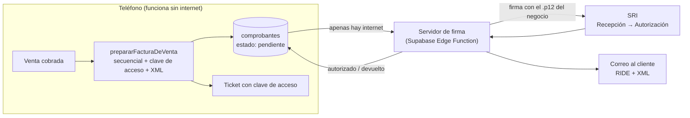

# Plan de facturación electrónica (Ecuador, SRI)

> Creado: 2026-10-08. Estado: **fase 1 lista** (núcleo local). Las tareas están en `TAREAS.md` como F-xx.
> Los datos normativos salen de fuentes públicas (al final). Antes de producción, confirmar todo con un contador y con la ficha técnica vigente del SRI.

## Decisión: implementación propia, firmando en un servidor

| Opción | A favor | En contra |
|---|---|---|
| **Propia** (recomendada) | Sin costo por factura; se integra con el modo sin internet; es un diferencial del SaaS | Más trabajo; hay que seguir los cambios de la ficha técnica del SRI |
| Proveedor externo con API | Rápido de conectar; ellos firman y envían | Cobran por documento o por mes; dependes de su servicio |

Si la fase 2 se complica, se puede cambiar a un proveedor sin rehacer la fase 1: el XML y los datos ya estarían listos.

## Cómo funciona el proceso del SRI

1. Se arma el XML de la factura con una **clave de acceso de 49 dígitos**.
2. Se **firma** con el certificado digital del negocio (archivo `.p12`, formato XAdES-BES).
3. Se envía al servicio de **Recepción** del SRI → responde RECIBIDA o DEVUELTA (con errores).
4. Se consulta el servicio de **Autorización** → AUTORIZADO o NO AUTORIZADO.
5. Se entrega al cliente el **RIDE** (la representación impresa: ticket o PDF) y el XML, por ejemplo por correo.

**Cambio importante de 2025-2026:** según la Resolución NAC-DGERCGC25-00000014 y notas que la comentan, se eliminó el plazo de 4 días hábiles y ahora la transmisión al SRI debe ser **inmediata**. Para una app que funciona sin luz ni internet esto es clave: cuando no hay conexión, la factura queda en cola y se envía apenas vuelve. Hay que confirmar con el contador qué permite la norma en esos casos (contingencia).

## Arquitectura en Postrapi

- **Por qué se firma en el servidor:** el `.p12` y su clave no deben viajar en cada teléfono. En el SaaS, cada negocio sube su firma una sola vez y queda cifrada en el servidor.
- **Un punto de emisión por caja o dispositivo** (001-001, 001-002…): así dos teléfonos sin conexión nunca repiten número de factura.
- **El número (secuencial) se asigna en el teléfono** en el momento de facturar, dentro de una transacción.

## Reglas de negocio que debes confirmar con un contador

- **Régimen:**
  - RIMPE *negocio popular* (hasta $20 000 al año): puede elegir entre notas de venta y factura electrónica.
  - RIMPE *emprendedor* y régimen general: la factura electrónica es obligatoria.
  - En el SaaS, cada restaurante tendrá su propio régimen y la app debe adaptarse.
- **IVA:** la tarifa general es 15 % (código 4 en la tabla del SRI). La app asume que **los precios del menú ya incluyen IVA** y separa base e impuesto. Se puede cambiar en la configuración.
- **10 % de servicio (propina):** el XML tiene el campo; hay que decidir si se cobra.
- **Consumidor final:** existe un monto máximo para facturar sin identificar al cliente. Confirmar el valor vigente.
- **Anulación:** una factura autorizada no se borra como hoy se anula una venta. Se anula en SRI en línea (hay plazo; la resolución menciona hasta el día 10 del mes siguiente) o se emite una **nota de crédito**.
- **Sin internet:** qué hacer y en qué plazo enviar las facturas guardadas durante un apagón.

## Fases

### Fase 1 — Núcleo local ✅ (hecho el 2026-10-08)
- `src/facturacion/`: validación de cédula y RUC, clave de acceso con módulo 11 (comprobada contra el ejemplo de la ficha técnica), cálculo de IVA con descuentos y armado del XML (versión 1.1.0).
- Tablas locales `clientes` y `comprobantes` (migración 0005; todavía no se sincronizan).
- `src/services/facturacion.service.ts`: configuración del emisor, y convertir una venta en factura pendiente con número consecutivo dentro de una transacción.
- Pruebas: `npm run probar:facturacion` (10 casos). Además se probó en la app web: 2 facturas (efectivo y transferencia con 10 % de descuento), los totales cuadran con lo cobrado, rechaza RUC y cédula inválidos y no deja facturar dos veces la misma venta.

### Fase 2 — Firma y envío (necesita tu firma)
- Validar el XML contra el **XSD oficial** de la ficha técnica vigente.
- Servidor de firma XAdES-BES con el `.p12` guardado cifrado.
- Cliente de los servicios del SRI en **ambiente de pruebas**: Recepción y Autorización.
- Reintentos automáticos y estados en la tabla `comprobantes`.

### Fase 3 — Pantallas
- **Gestión → Facturación:** datos del emisor, establecimiento, punto de emisión, ambiente, IVA.
- **Al cobrar:** "¿Factura?" → consumidor final, o buscar/crear cliente (cédula/RUC, nombre, correo).
- **Lista de comprobantes** con estado (pendiente, autorizado, devuelto) y botón de reintentar.
- **Ticket/RIDE** con clave de acceso y número de autorización; envío por correo.

### Fase 4 — Producción y SaaS
- Notas de crédito y anulaciones.
- Modo contingencia sin internet.
- Pasar al ambiente de producción.
- En el SaaS: cada negocio sube su firma y configura sus datos al registrarse.

## Lo que tienes que hacer tú

1. **Hablar con un contador** sobre los puntos de "Reglas de negocio" (sobre todo: régimen, si los precios incluyen IVA, el 10 % de servicio y qué hacer sin internet).
2. **Comprar una firma electrónica en archivo `.p12`** (no en token USB) a nombre del RUC con el que vas a probar. La emiten entidades de certificación acreditadas en Ecuador, por ejemplo Security Data, Uanataca o el Banco Central. Tiene costo anual.
3. **En SRI en línea**, opción de comprobantes electrónicos: solicitar el **ambiente de pruebas** y confirmar el establecimiento (001) y el punto de emisión (001).
4. **Decidir dónde corre el servidor de firma.** Mi recomendación es Supabase (Edge Functions), porque ya lo usamos. La alternativa es tu servidor propio.
5. **Cuando tengas la firma, no me la pases por el chat.** Te voy a indicar cómo subirla tú mismo al servidor, junto con su clave, para que nunca quede escrita en la conversación ni en git.

## Lo que hago yo

- Fase 1: hecha.
- Cuando tengas la firma y el ambiente de pruebas: fase 2 completa y primeras facturas de prueba autorizadas por el SRI.
- Fase 3 (pantallas): puedo empezarla antes de tener la firma, porque no depende de ella.
- Mantener este documento y las tareas F-xx al día.

## Fuentes

- [Ficha técnica de comprobantes electrónicos, esquema offline (SRI)](https://www.sri.gob.ec/o/sri-portlet-biblioteca-alfresco-internet/descargar/ed555352-46c7-4917-9f61-011b6a9f4600/FICHA%20TE%CC%81CNICA%20COMPROBANTES%20ELECTRO%CC%81NICOS%20ESQUEMA%20OFFLINE%20Versio%CC%81n%202.26.pdf)
- [Gosocket: cambios de la ficha técnica 2.26 (tabla de IVA, código 4 = 15 %)](https://gosocket.net/centro-de-recursos/el-sri-actualizo-la-ficha-tecnica-de-comprobantes-electronicos-off-line-version-2-26/)
- [Resolución NAC-DGERCGC25-00000014 (SRI)](https://www.sri.gob.ec/o/sri-portlet-biblioteca-alfresco-internet/descargar?id=137046a6-787c-47fb-a2d7-176595d292dc&nombre=NAC-DGERCGC25-00000014.pdf)
- [Boletín Contable: transmisión inmediata de comprobantes desde 2026](https://boletincontable.com/2026/01/03/transmision-inmediata-de-comprobantes-sri-2026/)
- [SRI: Régimen RIMPE](https://www.sri.gob.ec/en/rimpe)
