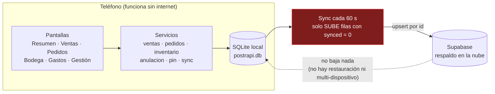
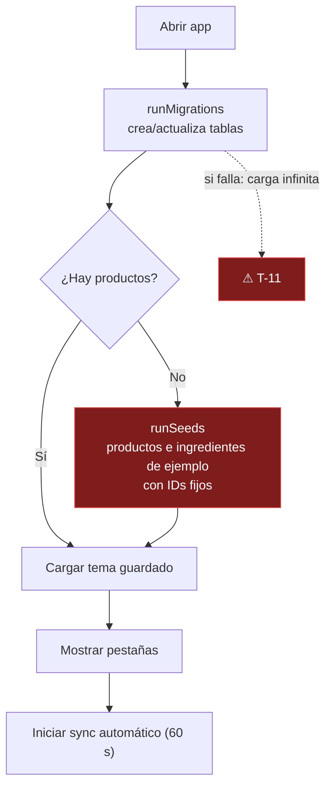
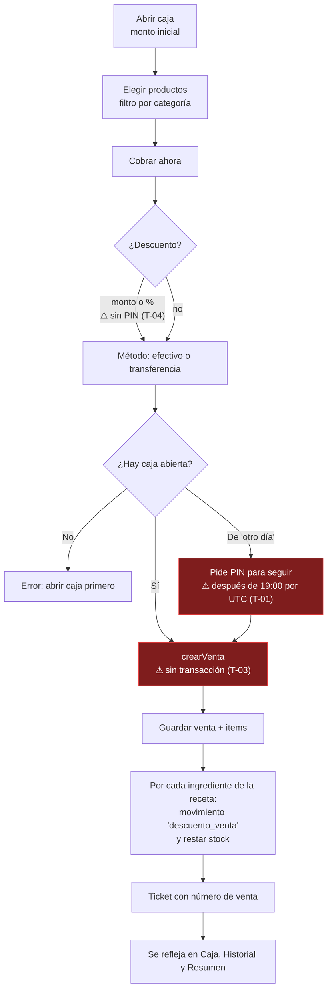
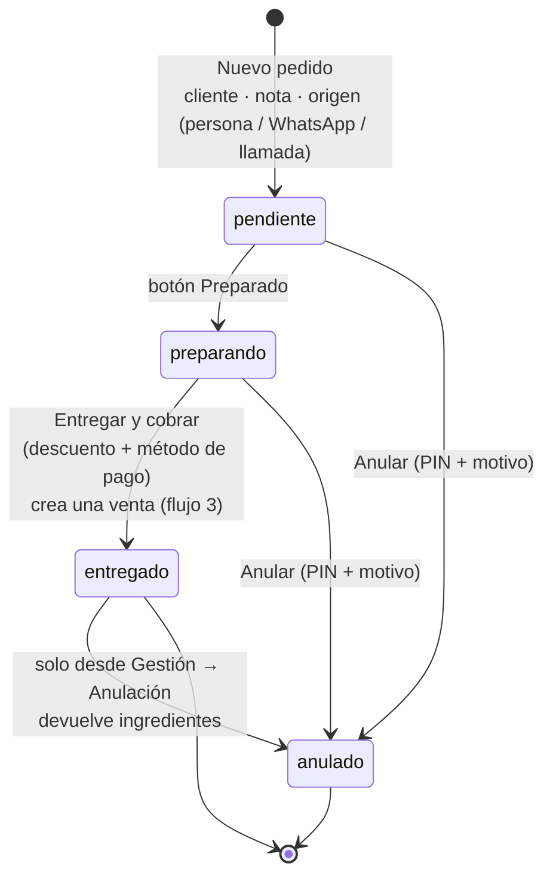
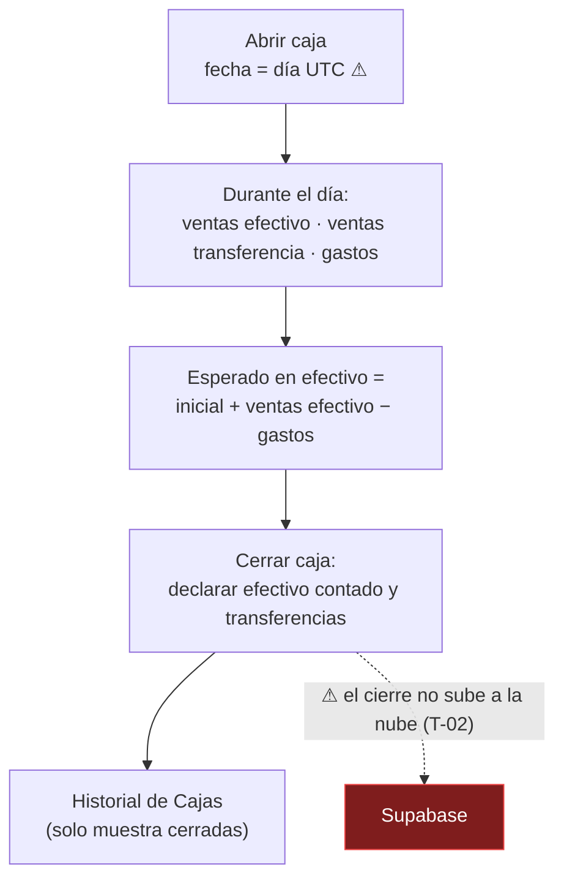
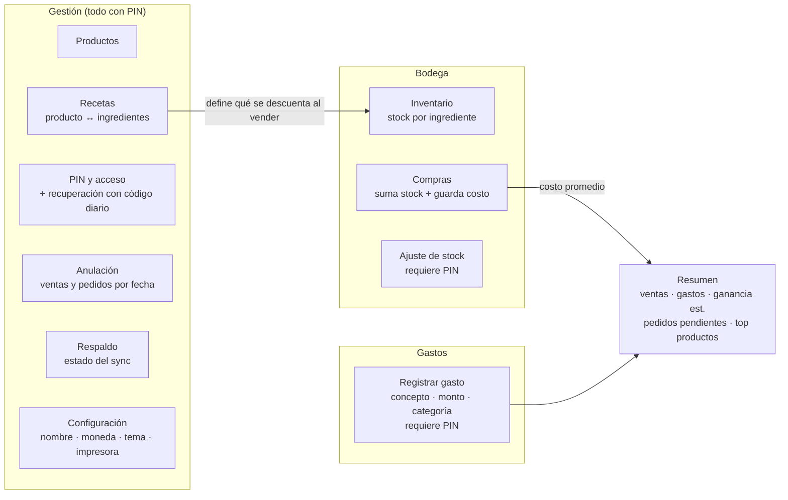

# Flujo de Postrapi (estado al 2026-10-07)

Los diagramas usan Mermaid; se ven en GitHub y en la vista previa de VS Code.
En rojo, los puntos con fallas conocidas (ver `TAREAS.md`).

## 1. Arquitectura

## 2. Arranque de la app

## 3. Venta directa (pestaña Ventas)

## 4. Pedido (pestaña Pedidos)

## 5. Caja diaria

## 6. Bodega, gastos y gestión

